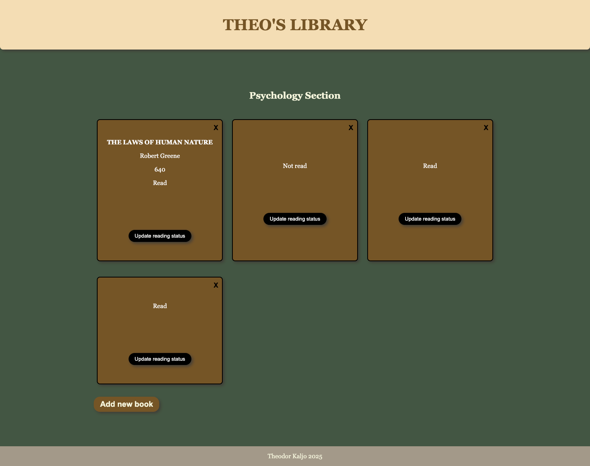

# Library App

This is a Library App created as part of an Odin Project assignment. It allows users to add, display, update, and remove books from their personal library.

---

## Features

- **Add Books**:  
  Use the "New Book" button to open a form and input book details, including title, author, pages, and read status.

- **Display Library**:  
  All books are displayed as cards, dynamically generated from an array.

- **Remove Books**:  
  Each book card includes a button to remove it from the library.

- **Toggle Read Status**:  
  Easily update a book's read status using a button on its card.

---

## Screenshot

---

## Assignment Goals

- **Book Management**:  
  Store book objects in an array and dynamically add them using a constructor function.
  
- **Separation of Concerns**:  
  Separate book data storage from the logic used to display books.

- **Dynamic Form Handling**:  
  Implement a form to add new books without reloading the page, using `event.preventDefault()`.

- **Interactive UI**:  
  Allow users to interact with the library through buttons to remove or toggle book statuses.

---

## Technologies Used

- **HTML5**: Structure and layout.
- **CSS3**: Styling and responsive design.
- **JavaScript**: DOM manipulation and functionality.

---

## Getting Started

1. Clone the repository.  
2. Open `index.html` in your browser.  
3. Add, update, and manage books using the UI.

---

## Future Enhancements

- **Local Storage**:  
  Save the library data to persist across sessions.
- **Search and Filter**:  
  Add functionality to search and filter books.
- **Enhanced UI**:  
  Improve the design with modals and animations.

---

## License

This project is open-source and available under the MIT License.# Library App